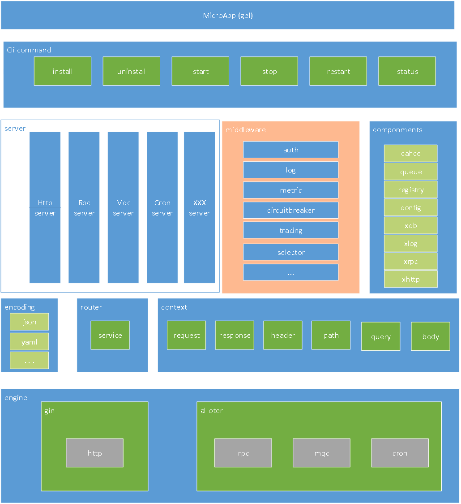

[glue](https://github.com/zhiyunliu/glue)


# 目标
像胶水一样沾合起各种需要的外部组件,隔离业务开发与外部组件的依赖，降低外部组件学习成本与心智消耗。


# 架构图




# 配置介绍

[config 样例](./docs/config.md)

```tree

├── app
│   ├── encrypt 数据加密key,当节点中配置`encrypt=true`的时候使用
│   ├── mode 启动模式 debug/release
│   ├── ip_mask 获取本地ip使用的掩码 
│   ├── dependencies 服务启动时候的依赖服务,MAC/Linux 下生效
│   ├── options 服务启动的选型配置，MAC/Linux 下生效
├── registry 注册中心配置 URI格式
├── config 配置中心配置 URI格式
├── caches 缓存配置
│   └── 数组 {"proto"：使用的协议,"addr":配置的类型和名称,URI 格式配置},
├── queues 消息队列配置
│   └── 数组 {"proto"：使用的协议,"addr":配置的类型和名称,URI 格式配置},
├── dbs 数据库配置
│   └── 字典 "数据库名称":{"proto":"使用的协议","conn":"链接串",xxx},
├── servers 服务器列表
│   └── apiserver 服务名称,对应 api.New("服务名称")
│   ├────└──服务配置,各服务差异具体参看 server/服务类型/config.go 文件
├── nacos/redis/consul/等由contrib/节点名 对应配置的结构


```

# 引擎 

## GIN 
    使用性能强大的GIN引起作为服务的底层支持 （github.com/gin-gonic/gin）

## alloter 
    在gin的基础，修改了部分源码，复用了gin的路由分发功能，使其可以作为 rpc ，mqc ,cron 的基础底座功能。

# 服务类型

## API 接口服务
    底层使用了GIN 框架作为http(s)服务的基础，在此基础上进行了服务注册，中间件的包装处理。默认注入recover ,log 两个中间件

## RPC 远程调用服务
    通过定义通用的proto传输协议 ,将RPC调用的数据统一格式传输。传输的消息格式默认提供grpc格式，可以根据自己需要自行实现传输消息格式

## MQC 消息队列服务
    统一的消息队列处理服务, 通过adapter模式集成各种消息队列外部组件. 默认支持 redis(list),redis(stream)

## CRON 定时任务服务
    使用了时间轮算法对任务进行任务派发，通过cron 表达式来计算任务的执行。同时支持多程序主备自动切换功能


## 自定义服务

实现以下接口即可

```golang 

import (
	_ "github.com/zhiyunliu/glue/transport"
	"github.com/zhiyunliu/glue/context"
	"github.com/zhiyunliu/glue/config"

) 

// Server is transport server.
type Server interface {
	Name() string
	Type() string
	Start(context.Context) error
	Stop(context.Context) error
	Config(cfg config.Config)
}

//

type demoServer struct{}

func (d demoServer) Name() string{
	return "demo"
}


func (d demoServer) Type() string{
	return "demo"
}


func (d demoServer) Start(context.Context) error{
	return nil 
}


func (d demoServer) Stop(context.Context) error{
	return nil 
}

func (d demoServer) Config(cfg config.Config){
	return  
}


func main() {

	app := glue.NewApp( glue.Server(&demoServer{}))//装载自定义服务
	app.Start()
}


```

## 自定义数据体解析encoding

```golang 
type urlecoded struct {
}

func (u urlecoded) Marshal(v interface{}) ([]byte, error) {
	return nil, nil
}

func (u *urlecoded) Unmarshal(data []byte, v interface{}) error {
	values, err := url.ParseQuery(string(data))
	if err != nil {
		return err
	}
	var mapdata = xtypes.XMap{}
	for k := range values {
		mapdata[k] = values.Get(k)
	}
	return mapdata.Scan(v)
}

func (u urlecoded) Name() string {
	return "x-www-form-urlencoded"
}

// github.com/zhiyunliu/glue/encoding
encoding.RegisterCodec(&urlecoded{})

```

## 自定义数据解析方法 WithDecodeRequestFunc

```golang 

样例（cron,mqc,rpc 有同样的方法）：
 	apiSrv := api.New("cronserver", api.WithDecodeRequestFunc(func(ctx context.Context, obj interface{}) error {
		//解析数据
	}))

```


# SQL解析支持


## 数据库自定义解析字符
```golang 

type symbol struct{}

func (s *symbol) Name() string {
	return "#"
}
func (s *symbol) GetPattern() string {
	return `\#\{\w*[\.]?\w+\}`
}
func (s *symbol) Callback(input tpl.DBParam, fullKey string, item *tpl.ReplaceItem) (string, xdb.MissParamError) {
	propName := tpl.GetPropName(fullKey)
	if ph, ok := item.NameCache[propName]; ok {
		return ph, nil
	}
	argName, value, err := input.Get(propName, item.Placeholder)
	if err != nil {
		return argName, err
	}
	item.Names = append(item.Names, propName)
	item.Values = append(item.Values, value)

	item.NameCache[propName] = argName
	return argName, nil
}

// github.com/zhiyunliu/glue/contrib/xdb
//注入sqlserver 数据库新的字符解析处理逻辑
tpl.RegisterSymbol("sqlserver", &symbol{})

```


## 参数化支持


```sql
@{field} 

如：
select * from table t where t.name = @{name}  
select * from table t where t.name = @{t.name}  
解析结果：
select * from table t where t.name = @p_name

```


## & 符合链接

将参数进行and链接，如果参数值不存在或者为空将不会生成and条件
```sql
&{field} ， &{t.field}

如： 
select * from table t where t.id = @{id} &{name} 
select * from table t where t.id = @{id} &{t.name} 

解析结果：
select * from table t where t.id = @p_id and name = @p_name --参数存在
select * from table t where t.id = @p_id and t.name = @p_name --参数存在
或者
select * from table t where t.id = @p_id --参数不存在或者为空,空字符

```

## | 符合链接

将参数进行or链接，如果参数值不存在或者为空将不会生成or条件

```sql
|{field} 

如：  
select * from table t where t.id = @{id} |{name} 
select * from table t where t.id = @{id} |{t.name} 

解析结果：
 select * from table t where t.id = @p_id or name = @p_name --参数存在
 select * from table t where t.id = @p_id or t.name = @p_name --参数存在
 或者
select * from table t where t.id = @p_id --参数不存在或者为空,空字符

```

## 原文替换
```sql
${field} 
如：select * from table t where t.id = ${id} 

解析结果：
select * from table t where t.id = 123 --123是id的参数值

```

## like 支持

```sql
&{like field} ，&{like %field}， &{like field%} ，&{like %field%}
&{like t.field} ，&{like %t.field}， &{like t.field%} ，&{like %t.field%}
|{like field} ，|{like %field}， |{like field%} ，|{like %field%}
|{like t.field} ，|{like %t.field}， |{like t.field%} ，|{like %t.field%}

样例： 
select * from table t where t.id = @{id} &{like name} 
select * from table t where t.id = @{id} &{like %name}
select * from table t where t.id = @{id} &{like name%}
select * from table t where t.id = @{id} &{like %name%}

select * from table t where t.id = @{id} |{like name} 
select * from table t where t.id = @{id} |{like %name}
select * from table t where t.id = @{id} |{like name%}
select * from table t where t.id = @{id} |{like %name%}


解析结果：
select * from table t where t.id = @p_id and name like @p_name
select * from table t where t.id = @p_id and name like '%'+@p_name
select * from table t where t.id = @p_id and name like @p_name+'%'
select * from table t where t.id = @p_id and name like '%'+@p_name+'%'

select * from table t where t.id = @p_id or name like @p_name
select * from table t where t.id = @p_id or name like '%'+@p_name
select * from table t where t.id = @p_id or name like @p_name+'%'
select * from table t where t.id = @p_id or name like '%'+@p_name+'%'

```

## 运算符支持（>,>=,<,<=）

```sql

&{> field} ,&{>= field}, &{< field} ,&{<= field}
&{> t.field} ,&{>= t.field}, &{< t.field} ,&{<= t.field}

----类似
|{> field} ,|{>= field}, |{< field} ,|{<= field}
|{> t.field} ,|{>= t.field}, |{< t.field} ,|{<= t.field}


样例： 
select * from table t where t.id = @{id} &{> name} 
select * from table t where t.id = @{id} &{>= name}
select * from table t where t.id = @{id} &{< name}
select * from table t where t.id = @{id} &{<= name}

select * from table t where t.id = @{id} &{> t.name} 
select * from table t where t.id = @{id} &{>= t.name}
select * from table t where t.id = @{id} &{< t.name}
select * from table t where t.id = @{id} &{<= t.name}


解析结果：
select * from table t where t.id = @p_id and name > @p_name
select * from table t where t.id = @p_id and name >= @p_name
select * from table t where t.id = @p_id and name < @p_name
select * from table t where t.id = @p_id and name <= @p_name

select * from table t where t.id = @p_id and t.name > @p_name
select * from table t where t.id = @p_id and t.name >= @p_name
select * from table t where t.id = @p_id and t.name < @p_name
select * from table t where t.id = @p_id and t.name <= @p_name

``` 


# 使用方式

## API 接口服务

```golang 

package main

import (
	"github.com/zhiyunliu/glue"
	"github.com/zhiyunliu/glue/context"
	"github.com/zhiyunliu/glue/server/api"
)

func main() {

	apiSrv := api.New("apiserver")
	apiSrv.Handle("/demo", func(ctx context.Context) interface{} {
		return map[string]interface{}{
			"a": "1",
		}
	})
	app := glue.NewApp(glue.Server(apiSrv))
	app.Start()
}

```


## RPC 服务

```json 
//配置文件 config.json

{

	"registry":"nacos://aliyun",	
	"rpcs":{
		"default":{}	
	},
	"nacos":{
		"aliyun":{
			"encrypt":false,
			"client":{"namespace_id":"365a3498-120a-4b56-8322-1990954b1675"},
			"server":[{"ipaddr":"192.168.1.155","port":8848}],
			"options":{"prefix":"api","group":"charge","cluster":"grey","weight":100}
		}
	},
    "servers":{
		"payserver":{
			"config":{"addr":":7080","status":"start"}
		}
    }
}

```

```golang 
package main

import (
	"time"

	"github.com/zhiyunliu/glue"
	"github.com/zhiyunliu/glue/context"
	_ "github.com/zhiyunliu/glue/contrib/registry/nacos" //注册中心

	"github.com/zhiyunliu/glue/server/rpc"
)

func main() {
	rcpSrv := rpc.New("payserver")
	rcpSrv.Handle("/demo", func(ctx context.Context) interface{} {
		ctx.Log().Infof("cron.demo:%s", time.Now().Format("2006-01-02 15:04:05"))
		return nil
	})

	app := glue.NewApp(glue.Server(rcpSrv))
	app.Start()
}

```


## MQC 消息队列服务

```json 
//配置文件 config.json
{
	"queues":{
		"default":{"proto":"redis","addr":"redis://localhost"},
        "stream":{"proto":"streamredis","addr":"redis://localhost","stream_max_len":100000,"concurrency":100,"buffer_size":"100000","blocking_timeout":2},
	},
	"redis":{
		"localhost":{
			"addrs":["192.168.0.120:6379"],
			"dial_timeout":10,
			"read_timeout":10,
			"write_timeout":10,
			"pool_size":20
		}
	},
    "servers":{
		"mqc":{
			"config":{"addr":"queues://default","status":"start"},
			"tasks":[{"queue":"xx","disable":true},{"queue":"key"}]
		}
    }
}

```

```golang 
package main

import (
	"github.com/zhiyunliu/glue"
   	"github.com/zhiyunliu/glue/context"

	_ "github.com/zhiyunliu/glue/contrib/queue/redis"
	"github.com/zhiyunliu/glue/examples/mqcserver/demos"
	"github.com/zhiyunliu/glue/server/mqc"
)

func main() {
	mqcSrv := mqc.New("mqc")

	mqcSrv.Handle("yy",func(ctx context.Context) interface{} {
		ctx.Log().Infof("mqc.demo:%s", time.Now().Format("2006-01-02 15:04:05"))
		return nil
	})

	app := glue.NewApp(glue.Server(mqcSrv))

	app.Start()
}

```


## CRON  定时任务服务

```json 
//配置文件 config.json
{
    "servers":{
		"cron":{
			"config":{"status":"start","sharding":1},
			"jobs":[
				{"cron":"@every 10s","service":"/demo/notrun","disable":true},
				{"cron":"@every 5s","service":"/demo"},
				{"cron":"@every 10s","service":"/demo","meta":{"a":"1","b":"2","c":"3"}},
				{"cron":"@every 15s","service":"/demo/nonebody"},
				{"cron":"@every 2s","service":"/demo/nonebody","immediately":true,"meta":{"immediately":"true"}}
			]
		}
    }
}

```

```golang 
package main

import (
	"github.com/zhiyunliu/glue"
   	"github.com/zhiyunliu/glue/context"
	"github.com/zhiyunliu/glue/examples/cronserver/demos"
	"github.com/zhiyunliu/glue/server/cron"
)

func main() {
	cronSrv := cron.New("cronserver")
	cronSrv.Handle("/demo", &Fulldemo{})
	app := glue.NewApp(glue.Server(cronSrv))

	app.Start()
}

 
type Fulldemo struct{}

func (d *Fulldemo) Handle(ctx context.Context) interface{} {	 
	return "success"
}

func (d *Fulldemo) NoneBodyHandle(ctx context.Context) interface{} {	 
	return "NoneBody"
}

func (d *Fulldemo) NotRunHandle(ctx context.Context) interface{} {
	return "NotRun"
}

```

# 服务注册方式

## 函数注册

```golang 
    //消息服务
	mqcSrv := mqc.New("mqc")
    //xy:pay:demo 是消息队列
	mqcSrv.Handle("xy:pay:demo",func(ctx context.Context) interface{} {
		//处理业务逻辑
		return nil
	})

    //cron,rpc 的方式与 api 一致
	apiSrv := api.New("api")
	apiSrv.Handle("/api/pay/create",func(ctx context.Context) interface{} {
		//处理业务逻辑
		return nil
	})


```

## 对象注册

```golang 

    type srvdemo struct{}

    //业务处理函数
    func(s *srvdemo) Handle(ctx context.Context) interface{}{
        return nil
    }

    //业务处理函数
    func(s *srvdemo) DetailHandle(ctx context.Context) interface{}{
        return nil
    }

    //rpc 的方式与 api 一致
	apiSrv := api.New("api")
	apiSrv.Handle("/api/pay/create",&srvdemo{})

    //注册的路由有
    /***
        url:GET|POST /api/pay/create
        url:GET|POST /api/pay/create/detail
    ***/

```

## 钩子函数

```golang 

    type srvdemo struct{}

    //钩子函数
    func(s *srvdemo) Handling(ctx context.Context) interface{}{
        return nil
    }

    //钩子函数
    func(s *srvdemo) Handled(ctx context.Context) interface{}{
        return nil
    }

    //业务处理函数
    func(s *srvdemo) Handle(ctx context.Context) interface{}{
        return nil
    }

    //业务处理函数
    func(s *srvdemo) DetailHandle(ctx context.Context) interface{}{
        return nil
    }

    //rpc 的方式与 api 一致
	apiSrv := api.New("api")
	apiSrv.Handle("/api/pay/create",&srvdemo{})

    //注册的路由有
    /***
        url:GET|POST /api/pay/create
        url:GET|POST /api/pay/create/detail
    ***/


```


# 基础组件使用

```golang 

  		//缓存使用
		cacheObj := glue.Cache("cachename") //cachename 对应config.json 文件中节点：caches/cachename
		cacheObj.Set(ctx.Context(), "name", "value", -1)

		//消息队列的使用
		queObj := glue.Queue("queuename")  //queuename 对应config.json 文件中节点：queues/queuename
		queObj.Send(ctx.Context(), "queuekey", queue.MsgItem{})

		//分布式锁的使用
		dlock := glue.DLocker().Build("")
		succ, err := dlock.Acquire(3) //锁定，超时时间3秒
		dlock.Release()               //释放
		dlock.Renewal(5)              //续期 5秒

		//http对象使用
		httpObj := glue.Http("httpname") //httpname 对应config.json 文件中节点：xhttp/httpname
		httpResp, err := httpObj.Request(ctx.Context(), "xhttp://servername/a/b/c", map[string]string{})

		//rpc对象使用
		rpcObj := glue.RPC("rpcname") //rpcname 对应config.json 文件中节点：rpcs/rpcname
		rpcResp, err := rpcObj.Request(ctx.Context(), "grpc://servername/apipath", map[string]string{})  

```

# 日志使用

    系统启动会检查 ../conf 是否存在logger.json 配置文件。如果不存在则以默认方式创建一个配置文件


```json
{
	"enable":true,
	"layout":{
		"file":{
			"level":"info",
			"path":"../log/%ndate/%level/%hh.log",
			"content":"[%time][%l][%session][%idx] %content"
		},
		"stdout":{
			"level":"info",
			"content":"[%time][%l][%session][%idx] %content"
		}
	}
}

```
```js
levels = [
	"debug",
	"info",
	"warn",
	"error",
	"panic",
	"fatal",
	"all",
	"off"
]
```


```golang

func main() {
	rcpSrv := rpc.New("payserver")

	rcpSrv.Handle("/demo", func(ctx context.Context) interface{} {

		//使用当前请求的session 打印日志。在一个请求中的所有日志都有相同的sessionid
		ctx.Log().Infof("rcpSrv.demo:%s", time.Now().Format("2006-01-02 15:04:05"))

		//使用系统session打印日志。
		log.Debug("debug")
		log.Debugf("debug:%s", "debug")
		log.Info("Info")
		log.Infof("Info:%s", "Info")
		log.Warn("Warn")
		log.Warnf("Warn:%s", "Warn")
		log.Error("Error")
		log.Errorf("Error:%s", "Error")
		log.Panic("panic")
		log.Panicf("panic:%s", "panic")

		return nil
	})

	app := glue.NewApp(glue.Server(rcpSrv))
	app.Start()
}

```

```text 
[10:40:41.988319][i][d90f919fd735435b][1] serviceApp start:apiserver-sample
[10:40:41.991298][i][d90f919fd735435b][3] API Server [apiserver] listening on 192.168.1.155:8080
[10:40:41.988319][i][d90f919fd735435b][2] serviceApp init completed
[10:40:42.993497][i][d90f919fd735435b][4] API Server [apiserver] start completed
[10:40:43.023944][i][d90f919fd735435b][5] pprof trace addr 192.168.1.155:18081
[10:40:45.032419][i][d90f919fd735435b][6] serviceApp start:apiserver-sample completed

```

