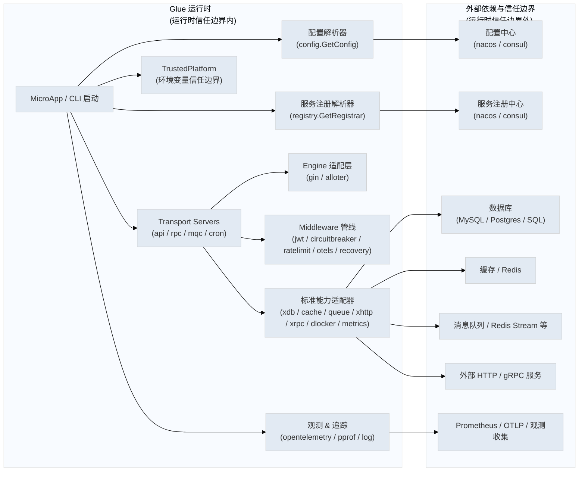

# Glue 运行时架构说明卡片

> 类型: 运行时架构
> 目标: 展示 Glue 运行时核心组件、外部依赖与信任边界

## 高层架构图

## 核心组件说明

- `MicroApp / CLI 启动`
  - 应用入口：`glue.NewApp` → `cli.New` → `ServiceApp.apprun`
  - 负责日志初始化、命令行解析、服务启动与关闭

- `配置解析器`
  - 核心包：`config`
  - 支持外部配置中心协议，如 `nacos://`、`consul://`

- `服务注册解析器`
  - 核心包：`registry`
  - 支持将服务实例注册到外部注册中心

- `Transport Servers`
  - `server/api`：HTTP API 服务
  - `server/rpc`：RPC / gRPC 服务
  - `server/mqc`：消息队列消费服务
  - `server/cron`：定时任务服务

- `Engine 适配层`
  - 核心包：`engine`
  - 当前适配器：`gin`、`alloter`
  - 负责路由注册与执行引擎抽象

- `Middleware 管线`
  - 核心目录：`middleware`
  - 处理身份认证、熔断、限流、追踪、错误恢复等

- `标准能力适配器`
  - 核心包：`standard`
  - 封装后端能力：`xdb`、`cache`、`queue`、`xhttp`、`xrpc`、`dlocker`、`metrics`

- `观测 & 追踪`
  - 核心包：`opentelemetry`
  - 还包括 `pprof` 诊断与日志体系

- `TrustedPlatform`
  - 来自环境变量 `TrustedPlatform`
  - 作为运行时信任边界的一部分

## 外部依赖与边界

- 配置中心：`nacos`、`consul`
- 服务注册中心：`nacos`、`consul`
- 数据库：`MySQL` / `Postgres` / 其他 SQL
- 缓存：`Redis`
- 消息队列：`Redis Stream` / MQC 等
- 外部 HTTP / gRPC 服务：通过 `xhttp`, `xrpc` 客户端访问
- 观测收集：`Prometheus` / `OTLP`

## 说明卡片适配

该文件已用 `Mermaid` 图表嵌入与结构化说明卡片形式组织，可直接用于 archify 或其他架构文档工具展示。
